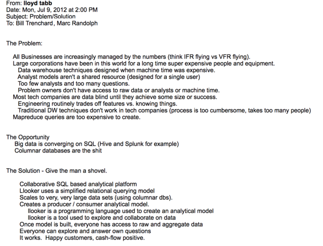

# The Inside Story of How This Startup Turned a 216-Word Pitch Email into a $2.6 Billion Acquisition

[Reference to full article](https://firstround.com/review/the-inside-story-of-how-this-startup-turned-a-216-word-pitch-email-into-a-2-6-billion-acquisition/?utm_source=angellist)

## Summary:-
  - finding the idea, 
    - IDEA: START WITH A CRISP THESIS AND DON’T RAISE TOO EARLY
    - Future founders, start with a really strong thesis on the problem you’re going to tackle. If you’re missing that first crucial ingredient, it’s best to keep your company building dreams on a low simmer while you work to figure one out.
    - If you’re building the same thing over and over again, that’s a signal that there might be a startup idea in there
  - standing out in the market,
    - STAND OUT IN THE CROWD BY DOUBLING DOWN ON BIG BETS AND DEMOING HOW YOU’RE DIFFERENT
  - experimenting with different models, 
    - the best founders go deep on a problem, understand all its nuances, and really immerse themselves in the customer’s pain point.
  - scaling sales, 
  - nailing customer success, and of course, 
  - assembling a winning team. From perspectives on curating company culture and intentionally screening early-hires to strategies for messaging a product's value and beating every bookings plan, early-stage teams will find plenty of wisdom here in this detailed accounting of how Looker got built.
    - Draw from a deeply personal problem and assemble the founding players.
  - Don’t raise seed money too early.
    - to self-sustain and delay hitting the investor circuit at first.
    - If you can’t demonstrate value, you’re asking investors to take it on faith. You’re asking them to take it on who you are, as opposed to the proof points sitting in front of them.

### The pitch email Lloyd Tabb sent to Bill Trenchard and Marc Randolph during Looker’s seed raise in 2012 

* “In the online world, you can't see what's going on physically. I've always thought building a tech-based startup is a bit like flying: There’s VFR, where the conditions are clear and you can see the runway, and there's IFR, where visibility is poor so you have to rely on your instruments,” 

* “All tech businesses are IFR. You can't see your customer. But the problem in 2011 was that most companies didn’t have instruments. So they were trying to fly, but they couldn’t see very well. And our bet was that if we could bring them tools to see, their businesses would take off. Several early Looker customers turned into unicorns. I’m obviously a bit biased here, but I think part of that is because they had a really good handle on their data. They could fly.” says Tabb
